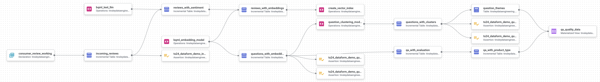

<div align="center">

# Building GenAI Data Pipelines with SQL (BigQuery Maching Learning & Dataform)

🤖 As enterprises deploy production GenAI applications, data analytics and engineering teams are increasingly tasked with maintaining the quality, freshness, and security of the data these models rely on and produce. Many of these teams are most comfortable working in a SQL-dominant environment, and would need to significantly upskill to perform this work by developing a substantial amount of Python code and leveraging tools like Tensorboard. These teams would benefit greatly from clear guidance on building data management and model evaluation pipelines using tools that more closely align with their skill sets, such as BQML and Dataform or dbt. This reposoitory provides guidance and sample code to lead teams through several common data management and model evaluation use cases.  Feel free to use this as a starting point for your own data pipelines.

[](https://cloud.google.com/dataform)
[](https://cloud.google.com/)
[](https://cloud.google.com/vertex-ai)

</div>

---

## 📋 Overview

Transform your customer feedback data into actionable insights using state-of-the-art AI/ML techniques:

- 🎯 Sentiment analysis using Gemini 1.5
- 🔍 Vector embeddings for semantic search
- 🔮 Intelligent question clustering
- 📊 Automated theme identification
- ⚡ Analytics on RAG system usage, quality and performance

## 🏗️ Architecture

<div align="center">



</div>

Built on enterprise-grade Google Cloud technologies:

- **Dataform** - Orchestration & transformation
- **BigQuery** - Serverless data warehouse
- **Vertex AI** - Machine learning operations
  - Gemini 1.5
  - Text Embedding API
  - Vector Search

## 🚀 Prerequisites Checklist

Before starting the deployment, ensure you have the following prerequisites in place:

### 1. Google Cloud Environment
- [ ] A Google Cloud project with billing enabled
- [ ] Owner or Editor role on the project

### 2. Development Tools
- [ ] Git (version >= 2.0)
- [ ] Terraform (version >= 1.0)
- [ ] Google Cloud SDK (version >= 440.0.0)

### Quick Validation Commands
```bash
# Verify all required tools are installed
gcloud --version
git --version
terraform --version

# Configure gcloud with your project
gcloud config set project PROJECT_ID

# Verify project access
gcloud projects describe PROJECT_ID
```

## 🚀 Setup Guide

Choose your preferred setup path:

<details>
<summary><h3>📱 Option A: Using Google Cloud Console (Recommended for Beginners)</h3></summary>

### Step 1: Initial Setup

1. **Access Google Cloud Console**
   - Navigate to [console.cloud.google.com](https://console.cloud.google.com)
   - Create or select your project
   - Note your `Project ID` for later use

2. **Enable Required APIs**
   - Go to [APIs & Services](https://console.cloud.google.com/apis/dashboard)
   - Click "Enable APIs and Services"
   - Enable the following:
     - BigQuery API
     - BigQuery Connection API
     - Cloud Storage API
     - Vertex AI API

### Step 2: Create Storage Bucket

1. Navigate to [Cloud Storage](https://console.cloud.google.com/storage)
2. Click "Create Bucket"
   - Name: `your-project-consumer-reviews`
   - Location: `us-central1`
   - Default storage class: `Standard`
   - Access control: `Uniform`
3. Click "Create"
4. Upload Data:
   - Open your new bucket
   - Click "Upload Files"
   - Select the sample data file from `genai_data_pipeline/data/consumer_review_data.parquet`
   - Wait for completion

### Step 3: Initialize BigQuery Dataset

1. Open [BigQuery Console](https://console.cloud.google.com/bigquery)
2. Create Dataset:
   - Click your project name
   - Click "Create Dataset"
   - Dataset ID: `consumer_reviews_dataset`
   - Data location: `US (multi-region)`
   - Click "Create dataset"
3. Load Data:
   - Click "Create Table"
   - Source: Select "Google Cloud Storage"
   - File format: `Parquet`
   - Source path: `gs://your-project-consumer-reviews/consumer_review_data.parquet`
   - Table name: `consumer_review_data`
   - Schema: Select "Auto detect"
   - Click "Create table"

### Step 4: Configure Remote Connection

1. **Create Connection**
   - In BigQuery, click "More" → "Connections"
   - Click "Create Connection"
   - Configure:
     ```
     Connection type: Cloud Resource
     Service: Vertex AI
     Connection ID: vertex-ai
     Location: us-central1
     ```
   - Click "Create"

2. **Set Up Permissions**
   - Go to [IAM & Admin](https://console.cloud.google.com/iam-admin)
   - Find: `bq-connection-sa@your-project-id.iam.gserviceaccount.com`
   - Add roles:
     - Vertex AI User
     - BigQuery Admin

### Step 5: Update Configuration Files

1. Edit `dataform.json`:
   ```json
   {
     "defaultSchema": "consumer_reviews_dataset",
     "defaultDatabase": "your-project-id",
     "defaultLocation": "US"
   }
   ```

2. Edit `includes/constants.js`:
   ```javascript
   const PROJECT_ID = "your-project-id";
   const SCHEMA_NAME = "consumer_reviews_dataset";
   const REMOTE_CONNECTION = "projects/your-project-id/locations/us-central1/connections/vertex-ai";
   ```

### Step 6: Verify Setup

1. In BigQuery Console:
   - Run: `SELECT COUNT(*) FROM consumer_reviews_dataset.consumer_review_data`
2. Check Connection:
   - Go to "Connections"
   - Verify `vertex-ai` status is "Connected"

</details>

<details>
<summary><h3>💻 Option B: Using Command Line</h3></summary>

### Step 1: Initial Setup

```bash
# Set environment variables
export PROJECT_ID="your-project-id"
export BUCKET_NAME="${PROJECT_ID}-consumer-reviews"

# Configure gcloud
gcloud config set project $PROJECT_ID

# Enable APIs
gcloud services enable bigquery.googleapis.com
gcloud services enable bigqueryconnection.googleapis.com
gcloud services enable storage.googleapis.com
gcloud services enable aiplatform.googleapis.com
```

### Step 2: Create Storage Bucket

```bash
# Create bucket
gsutil mb -l us-central1 gs://$BUCKET_NAME

# Upload data
gsutil cp genai_data_pipeline/data/consumer_review_data.parquet gs://$BUCKET_NAME/raw/reviews/
```

### Step 3: Initialize BigQuery Dataset

```bash
# Create dataset
bq mk --dataset \
  --location=US \
  ${PROJECT_ID}:consumer_reviews_dataset

# Load data
bq query --use_legacy_sql=false \
  "LOAD DATA INTO \`${PROJECT_ID}.consumer_reviews_dataset.consumer_review_data\`
   FROM FILES (
     format = 'PARQUET',
     uris = ['gs://${BUCKET_NAME}/consumer_review_data.parquet']
   );"
```

### Step 4: Configure Remote Connection

```bash
# Create connection
bq mk --connection \
  --location=us-central1 \
  --project_id=${PROJECT_ID} \
  --connection_type=CLOUD_RESOURCE \
  vertex-ai

# Get service account
export CONNECTION_SA=$(bq show --connection ${PROJECT_ID}.us-central1.vertex-ai \
  | grep "serviceAccountId" | cut -d'"' -f4)

# Grant permissions
gcloud projects add-iam-policy-binding ${PROJECT_ID} \
  --member="serviceAccount:${CONNECTION_SA}" \
  --role="roles/aiplatform.user"

gcloud projects add-iam-policy-binding ${PROJECT_ID} \
  --member="serviceAccount:${CONNECTION_SA}" \
  --role="roles/bigquery.admin"
```

### Step 5: Update Configuration Files

```bash
# Get connection ID
export CONNECTION_ID=$(bq show --connection ${PROJECT_ID}.us-central1.vertex-ai \
  | grep "name" | cut -d'"' -f4)

# Update files (manual step)
echo "Update dataform.json and constants.js with your project details"
```

### Step 6: Verify Setup

```bash
# Check data
bq query --use_legacy_sql=false \
  "SELECT COUNT(*) FROM ${PROJECT_ID}.consumer_reviews_dataset.consumer_review_data"

# Verify connection
bq show --connection ${PROJECT_ID}.us-central1.vertex-ai

# Test Vertex AI access
gcloud ai models list --region=us-central1
```

</details>

## 🔄 Pipeline Components

### Review Processing
1. `incoming_reviews` - Data ingestion & validation
2. `reviews_with_sentiment` - Sentiment analysis
3. `reviews_with_embeddings` - Vector embedding generation
4. `create_vector_index` - Similarity search indexing

### Question Analysis
1. `questions_with_embeddings` - Semantic embedding
2. `questions_with_clusters` - K-means clustering
3. `question_themes` - Theme generation
4. `qa_with_evaluation` - Quality assessment
5. `qa_with_product_type` - Product classification
6. `qa_quality_data` - Analysis aggregation

## 🏷️ Tags

- `process_reviews` - Review processing
- `quality_data_prep` - Question analysis
- `bqml_model` - Model operations
- `vector_index_creation` - Search setup
- `regenerate_question_themes` - Theme updates

## ✅ Data Quality

Built-in data quality checks ensure:
- ✓ Key uniqueness
- ✓ Required field validation
- ✓ Row-level conditions
- ✓ Incremental processing

## 📦 Dependencies

- @dataform/core: 2.8.3
- Google Cloud Platform:
  - BigQuery
  - Vertex AI (Gemini)
  - Cloud Storage

## 🆘 Troubleshooting

<details>
<summary>Common Issues & Solutions</summary>

### Permission Errors
```bash
# Verify IAM roles
gcloud projects get-iam-policy $PROJECT_ID \
  --flatten="bindings[].members" \
  --format='table(bindings.role)' \
  --filter="bindings.members:$(gcloud config get-value account)"
```

### Connection Issues
```bash
# Check API status
gcloud services list --enabled | grep -E "bigquery|aiplatform"

# Verify service account
gcloud iam service-accounts describe ${CONNECTION_SA}
```

### Data Loading Issues
```bash
# Check job status
bq show -j ${PROJECT_ID}:US.recent_job_id
```

</details>

---
